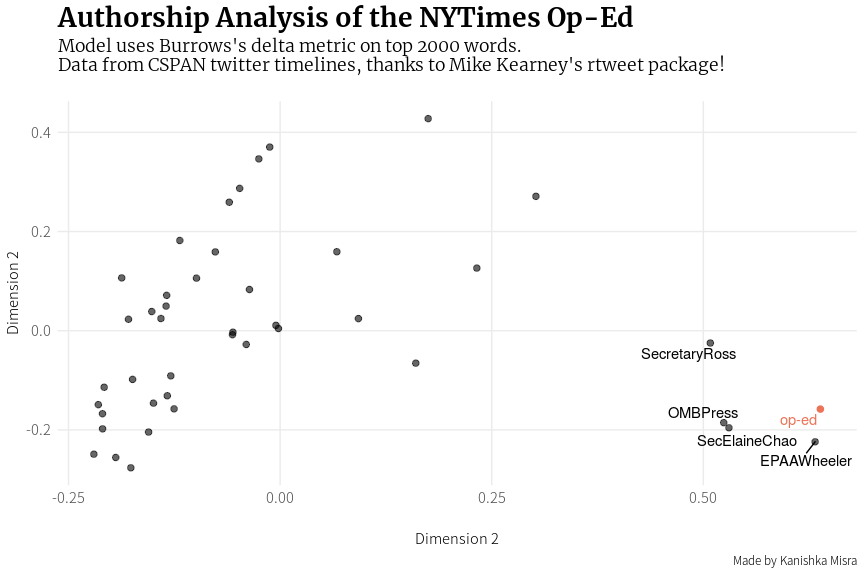

Resistance Inside Trump's White House - An analysis of authorship
================
Kanishka Misra
September 5, 2018

This document is an analysis of the authorship of the [nytimes op-ed](https://www.nytimes.com/2018/09/05/opinion/trump-white-house-anonymous-resistance.html) that was published today.

``` r
library(tidyverse)
library(tidytext)
# install my version of the widyr package to utilize some helpful functions
# devtools::install_github("kanishkamisra/widyr")
library(rtweet)
library(widyr)
library(rvest)
library(ggrepel)
```

Getting CSPAN Data
------------------

Thanks to [Mike Kearney](https://twitter.com/kearneymw) and his own [version of this analysis](https://github.com/mkearney/resist_oped), we can get the tweets of all CSPAN member accounts using the rtweet package (also by Dr. Kearney). This data is the best source of textual content that can work for the model, however once I get more ideas, I will potentially turn this into a blog post on my [blog](http://kanishka.xyz).

``` r
## This code is not going to be evaluated while producing the document.
cab_twits <- lists_members(owner_user = "CSPAN", slug = "the-cabinet")

cab_tweets <- cab_twits %>%
  filter(screen_name != "realDonaldTrump") %>%
  pull(user_id) %>%
  map(get_timeline, n = 4000) %>%
  bind_rows()

tweet_text <- cab_tweets %>%
  select(author = screen_name, text)

## Writing it outside my github repo, this can be reproduced by using the code above :)
write_csv(tweet_text, "../tweet_text.csv")
```

Scraping the NYTimes article text
---------------------------------

We use the rvest package to get the text from the op-ed.

``` r
## Reading back the tweets from a separate directory
tweet_text <- read_csv("../tweet_text.csv")
```

    ## Parsed with column specification:
    ## cols(
    ##   author = col_character(),
    ##   text = col_character()
    ## )

``` r
url <- "https://www.nytimes.com/2018/09/05/opinion/trump-white-house-anonymous-resistance.html"

oped_text <- read_html(url) %>%
  html_nodes("p") %>%
  html_text() %>%
  .[setdiff(3:31, 4)] %>%
  glue::glue_collapse()

oped_tbl <- tibble(
  author = "op-ed",
  text = oped_text
)
```

pre-processing
--------------

``` r
all_texts <- bind_rows(oped_tbl, tweet_text)
```

    ## Warning in bind_rows_(x, .id): Vectorizing 'glue' elements may not preserve
    ## their attributes

``` r
# remove some urls, hashtags, mentions, individually numeric elements then tokenize and count global term-frequencies
tokens <- all_texts %>%
  mutate(
    text = str_replace_all(text, "#\\S+|@\\S+|RT\\s?:?", ""),
    text = str_replace_all(text,"https?:\\/\\/(www\\.)?[-a-zA-Z0-9@:%._\\+~#=]{2,256}\\.[a-z]{2,6}\\b([-a-zA-Z0-9@:%_\\+.~#?&//=]*)", "")
  ) %>%
  unnest_tokens(word, text, strip_numeric = TRUE)

# Get the top 2000 tokens
top_tokens <- tokens %>%
  count(word) %>%
  top_n(2000)
```

    ## Selecting by n

``` r
# compute relative frequencies of the top 2000 tokens for each document
text_tokens <- tokens %>%
  count(author, word) %>%
  group_by(author) %>%
  mutate(rel_freq = n/sum(n)) %>%
  ungroup() %>%
  filter(word %in% top_tokens$word)

text_tokens %>%
  head()
```

| author       | word    |    n|  rel\_freq|
|:-------------|:--------|----:|----------:|
| BetsyDeVosED | 1st     |    1|  0.0000817|
| BetsyDeVosED | 4th     |    2|  0.0001633|
| BetsyDeVosED | a       |  185|  0.0151057|
| BetsyDeVosED | ability |    2|  0.0001633|
| BetsyDeVosED | able    |    6|  0.0004899|
| BetsyDeVosED | about   |   32|  0.0026129|

Analysis - trivial method
-------------------------

This document uses the Burrows' Delta method which is a distance calculation between documents and has stylometric (authorship attribution) benefits. It can be mathematically defined as:


Or, for 2 documents *D*<sub>1</sub> and *D*<sub>2</sub> the average manhattan distance between the z-scores for word frequencies of word *i* in the documents. The z-scores standardize the frequencies of each word to have 0 mean and 1 standard deviation (normal distribution centered around 0). There has been a little bit of dispute about the mathematical foundations of this method, the explanation and resolution of which can be found in [Argamon's paper](http://citeseerx.ist.psu.edu/viewdoc/download?doi=10.1.1.842.4317&rep=rep1&type=pdf), but since it has historically worked so well in authorship attribution, it is still used when distance based methods get employed.

I implemented this in David Robinson's widyr package and it can be called by using `pairwise_delta()`, similar to the other pairwise functions the package offers.

Let's look at the closest (least distant, since delta is a distance measure) documents to the Op-Ed:

``` r
deltas <- text_tokens %>%
  pairwise_delta(author, word, rel_freq)

deltas %>%
  filter(item2 == "op-ed") %>%
  arrange(delta)
```

| item1           | item2 |      delta|
|:----------------|:------|----------:|
| SecElaineChao   | op-ed |  0.6335436|
| EPAAWheeler     | op-ed |  0.8870305|
| OMBPress        | op-ed |  0.9183042|
| SecretaryRoss   | op-ed |  1.0004179|
| POTUS           | op-ed |  1.0258861|
| stevenmnuchin1  | op-ed |  1.0303278|
| USTradeRep      | op-ed |  1.0313551|
| SecPompeo       | op-ed |  1.0568985|
| SecShulkin      | op-ed |  1.0608937|
| SecPriceMD      | op-ed |  1.0646571|
| Cabinet         | op-ed |  1.0666507|
| SecretaryZinke  | op-ed |  1.0696611|
| SecNielsen      | op-ed |  1.0727432|
| USUN            | op-ed |  1.0801643|
| SBALinda        | op-ed |  1.0817828|
| VP              | op-ed |  1.0862680|
| Interior        | op-ed |  1.0865814|
| BetsyDeVosED    | op-ed |  1.0880467|
| SecretaryPerry  | op-ed |  1.0895596|
| nikkihaley      | op-ed |  1.0904755|
| ENERGY          | op-ed |  1.0905174|
| SecretaryCarson | op-ed |  1.0912557|
| StateDept       | op-ed |  1.0928579|
| SecAzar         | op-ed |  1.0945733|
| TheJusticeDept  | op-ed |  1.0947025|
| USDA            | op-ed |  1.0955371|
| SecretaryAcosta | op-ed |  1.0959868|
| USTreasury      | op-ed |  1.0960925|
| mike\_pence     | op-ed |  1.0988603|
| SBAgov          | op-ed |  1.0993618|
| usedgov         | op-ed |  1.0997798|
| USDOL           | op-ed |  1.1088474|
| HHSGov          | op-ed |  1.1123982|
| DeptofDefense   | op-ed |  1.1210607|
| USDOT           | op-ed |  1.1222278|
| DeptVetAffairs  | op-ed |  1.1314927|
| CommerceGov     | op-ed |  1.1336245|
| SecretarySonny  | op-ed |  1.1386345|
| CIA             | op-ed |  1.1414124|
| DHSgov          | op-ed |  1.1443877|
| EPA             | op-ed |  1.1511474|
| HUDgov          | op-ed |  1.1556952|

To better understand this, we can scale the data to two dimensions using a technique called multidimensional scaling, which can help in plotting. This is only available on my repository of the widyr package as it is yet to be approved in my latest pull request to widyr.

``` r
multi_scaled <- deltas %>%
  multi_scale(item1, item2, delta) %>%
  mutate(
    color = ifelse(item == "op-ed", "#EC7357", "#000000"),
    alpha = ifelse(item == "op-ed", 1, 0.6)
  )

## top closest authors
closest <- c(
  deltas %>% 
    filter(item2 == "op-ed") %>% 
    top_n(4, -delta) %>%
    pull(item1),
  "op-ed"
)

# Plot!
multi_scaled %>%
  ggplot(aes(V1, V2, color = color, alpha = alpha)) +
  geom_point(size = 2) +
  scale_color_identity() +
  scale_alpha_identity() +
  geom_text_repel(
    data = multi_scaled %>% filter(item %in% closest),
    aes(label = item),
    alpha = 1
  ) +
  theme_minimal() +
  theme(
    plot.title = element_text(face = "bold", size = rel(1.8), family = "Merriweather"),
    plot.subtitle = element_text(size = rel(1.2), family = "Merriweather Light", margin = margin(0,0,20,0)),
    text = element_text(family = "Noto Sans CJK JP Light"),
    axis.title.x = element_text(margin = margin(20, 0, 0, 0)),
    axis.text = element_text(size = rel(1)),
    panel.grid.minor = element_blank(),
    legend.text = element_text(size = rel(1))
  ) + 
  labs(
    title = "Authorship Analysis of the NYTimes Op-Ed",
    y = "Dimension 2",
    x = "Dimension 2",
    color = "",
    subtitle = "Model uses Burrows's delta metric on top 2000 words.\nData from CSPAN twitter timelines, thanks to Mike Kearney's rtweet package!",
    caption = "Made by Kanishka Misra"
  )
```



More content coming soon!
-------------------------

We can use better methods to detect authorship of this op-ed. Some of the improvements on this trivial approach include:

-   Parsing executive/formal documents written by the members of the administration - if this can be obtained, we can get a better estimate of the closest authors to the document's features.
-   Using modern methods that leverage features more robust than just word relative frequencies - word embeddings, tf-idfs, nrgrams!
